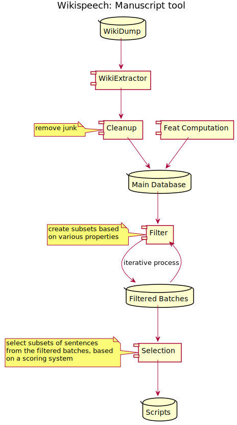
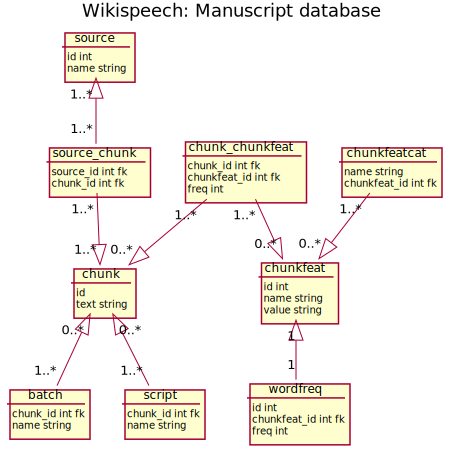

# wikispeech-manuscriptor

Tools for selecting a smaller set of sentences from a larger text corpus, for creating manuscripts for TTS and ASR.

## Contents

I. Requirements    
II. Set up DB    
III. Scripttool    
IV. Config files    
V. Sample scripts    
VI. Documentation    

# I. Requirements
* python3
* sqlite3
* go 1.16 (or higher)

# II. Set up DB

## 1. Download Wikipedia dump file

For Swedish: https://dumps.wikimedia.org/svwiki/latest/svwiki-latest-pages-articles-multistream.xml.bz2    

## 2. Extract text 

     python wp_dump_extract/WikiExtractor.py --no_templates -o <out dir> <dump file>

The above step takes a lot of time.

## 3. Create empty Sqlite3 db file:

     cat dbapi/schema_sqlite.sql | sqlite3 <new db file>

## 4. Load data into database

      go run cmd/load_db/main.go <options> <db file> <featcatdir> <WikiExtractor.py output files>

where `featcatdir` is the directory in which feature category/domain files reside. This repository contains a set of domain files, located in the `feat_data` folder: Swedish words for sports, weather, common names, etc. More information can be found in the documentation <a href="doc/manuscript_tool.pdf">manuscript_tool.pdf</a> (Swedish only).

The above steps takes a lot of time and will eventually create a huge
database file. The database becomes very large, since for every
sentence in the corpus, a large amount of features and relations are added to
the database.

# III. Scripttool

`scripttool` is a CLI for manipulating a script database created according to instructions above. You create batches by filtering sentences in the database, and from these batches, you can create output manuscripts. You can also retreive information about the database, such as list existing batches/scripts, print db statistics, etc.

Usage:

      go run cmd/scripttool/*.go <db file> <command> <args>

For full usage and documentation, please invoke

      go run cmd/scripttool/*.go

## Examples:

### Create script from a config file

     go run cmd/scripttool/*.go <db file> scriptgen <config file>

Some config examples can be found in folder `config_examples`.

Sample scripts and their config files can be found in the folder `sample_scripts`.

### List available filter features

     go run cmd/scripttool/*.go <db file> list_filter_feats

### List available selection features

     go run cmd/scripttool/*.go <db file> list_selector_feats

### Print full usage info

     go run cmd/scripttool/*.go <db file> help

# IV. Config files

Sample config files for creating batches/scripts can be found in the `config_examples` folder.

# V. Sample scripts

Sample scripts and their config files can be found in the folder `sample_scripts`.

# VI. Documentation

## Description of the selection process (in Swedish)

<a href="doc/manuscript_tool.pdf">manuscript_tool.pdf</a>

## UML Diagram

## DB schema (partial)

---

_This work was supported by the Swedish Post and Telecom Authority (PTS) through the grant "Talresursinsamlaren – För ett tillgängligare Wikipedia genom Wikispeech" (2019–2021)._
